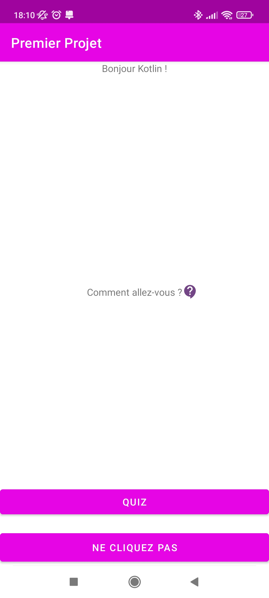
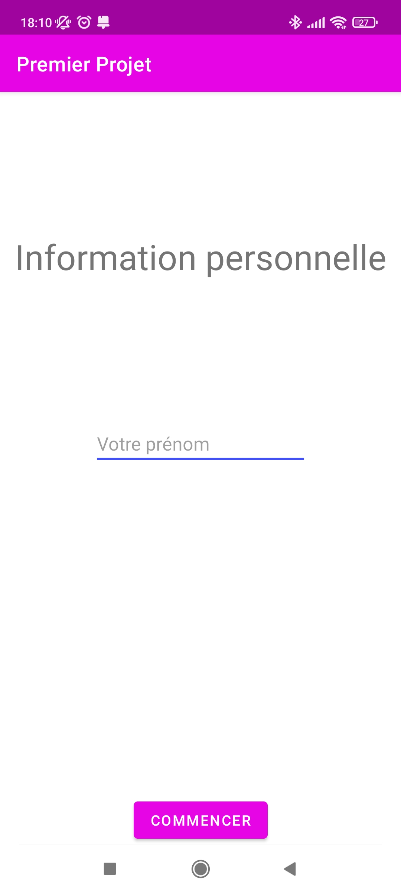
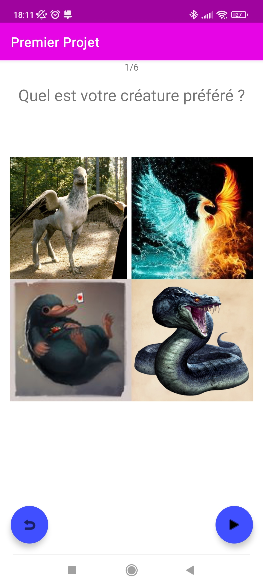
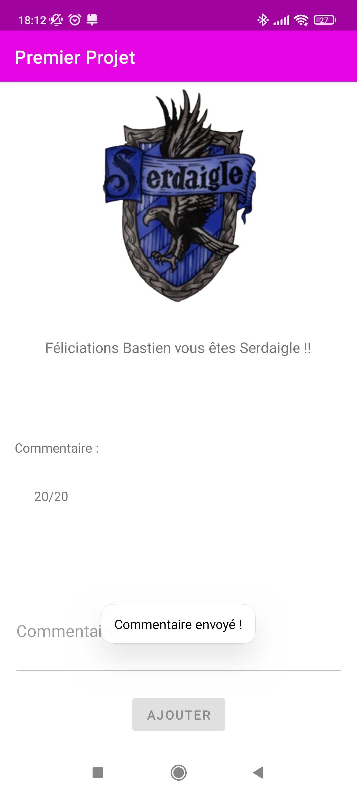
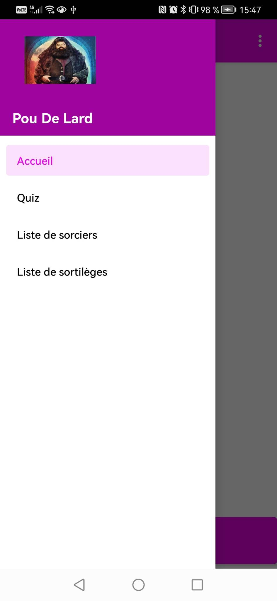
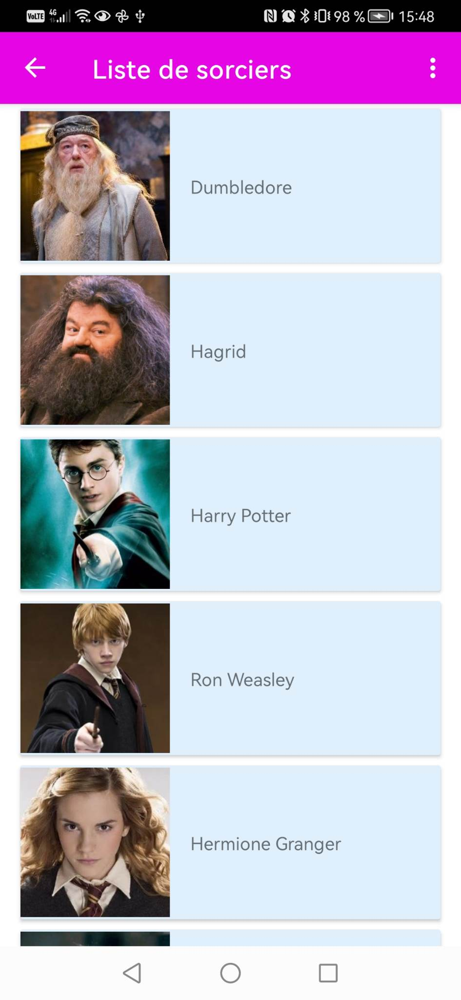
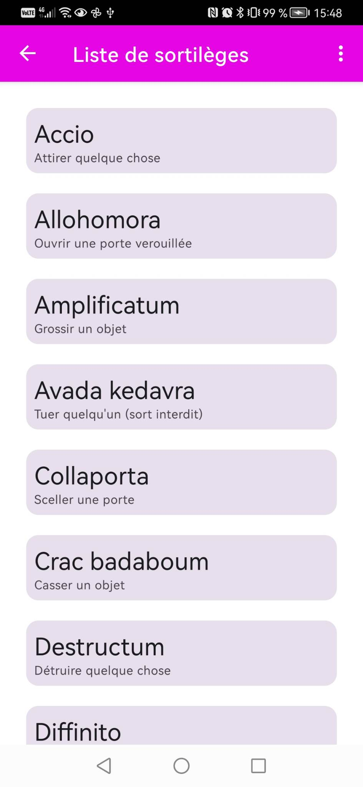

# Project 1 Kotlin of CVBB : Leviosa !

## Team presentation
- Bastien BRUNET M1 Développement Logiciel, Mobile et IOT
- Clara VESVAL M1 Développement Logiciel, Mobile et IOT

We know each other since the start of third year and are used to work together.
We are complementary.

## Project presentation
For the first level 2 mobile development project of this year, we are coding a native android app with Kotlin.
We have to foolow the good practices of an android and kotlin project.
- [X] Customize color in App bar
- [X] Change the launcher icon
- [X] Add a language
- [X] Use of string.xml (/!\ hard coded var /!)
- [X] Coherence in naming convention

### Tools
We are using Android Studio Electrical Eel (Be careful if you're not using this version, there could be some compatibility issues)
We are compiling in Android 33, our target is Android 33

### Architecture
Our application is available in English and French

#### Quiz
We have a home page as well as a page to gain access to our awesome quiz that will reveal which Hogwart house you belong to !
During this quiz, you will answer to a number of questions in order to discover if you are a ~~Slytherin~~ or a Gryffindor :)

We are using the differents widgets available for android to build a complete form :
- RadioButton
- EditText
- Image
- CheckBox
- Switch
- Spinner
- AutoComplete

There are also questions with pictures to choose from!
And even gifs to illustrate the question

Each answer is worth a certain amnount of points, that's how we can determine which is yours !

#### Menu

Before we only worked with Activities, when we had to do the menu, we switched to Fragments and ViewModel
For the menu of our application, we opted for:
- OptionMenu
- NavigationDrawer

#### Lists
For the rest of the exercise, we wanted to stay in the Harry Potter universe.

For the part concerning the lists of elements, we wanted to make the 2 possibilities:
- With the RecyclerView and Adapter (with wizard list)
- With Compose (with the list of spells)

### Showtime
Here is a simple demonstration of how the app is designed to be used, starting from the home screen to the end result :

#### V1 (only first project and quiz)

#### V2 (menu and lists)

